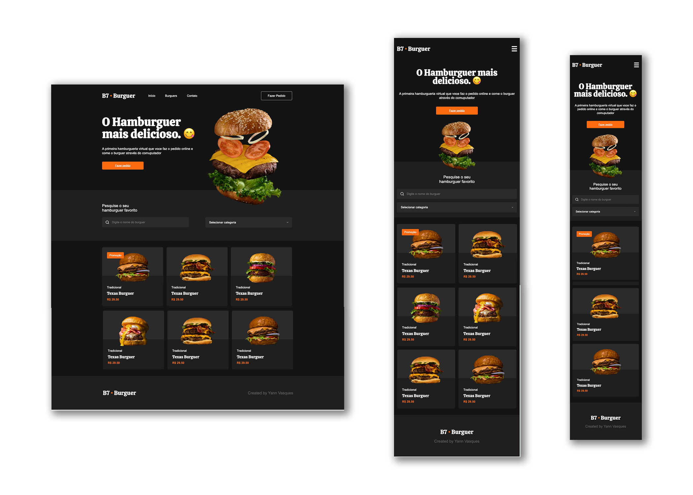

## B7 Burguer 🍔

B7 Burguer é um projeto de hamburgueria virtual onde os usuários podem fazer pedidos online e "degustar" os burguers diretamente do computador.

Este site foi construído a partir de um exercício da B7Web para aprender as funcionalidades do CSS, HTML e responsividade para mobile e tablet.

🚀 Tecnologias Utilizadas

HTML5

CSS3

O projeto pode ser acessado em: https://yvasques.github.io/burguer_responsiveWebsite/
   
